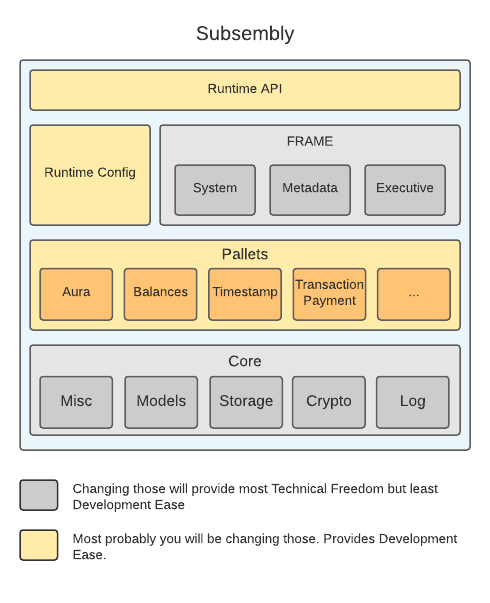

<p align="center">
  
</p>

<div align="center">
  
[](https://opensource.org/licenses/Apache-2.0) 

</div>

This is the starter project for the Subsembly framework used for developing `Substrate` runtimes in AssemblyScript. The project is work in progress.

## High-Level Overview
<p align="center">
  
</p>

- **Runtime API** - Implementation of Node <> Runtime Entries
- **Runtime Configuration** - Configurable runtime similar to `Substrate` Runtimes
- **FRAME** - Runtime components that handle the administrative functionalities
- **Pallets** - Packages that deliver common functionality, reused in different chains
- **Core** - Runtime components that provide low-level functionality

### Folder Structure
Subsembly starter project consists of following folders:
```
subsembly
    assembly/
    │
    └───runtime    <--- Runtime API entries && defined types
    |
    └───frame      <--- Contains Executive and System modules used for orchestrating Runtime
    │
    └───pallets    <--- Subsembly pallets include in Runtime

    spec-files/    <--- Raw chain-spec files
```

Main types and API entries are defined in `runtime` folder. `runtime.ts` file in `runtime` folder defines types and constants for the frame modules and pallets.

## Developing Subsembly Runtimes

#### Runtime configuration

Top-level runtime folder consists of Runtime API entries that are exposed to the Host. There is also, `runtime.ts` file, where types and constants for the frame modules and pallets are defined. We define general types that are used across the runtime and also pallet specific constants and types. 

There are some requirements for Runtime types, such as:

- Type should implement `Codec` interface from `as-scale-codec`. It makes sure that every type in the Runtime can be SCALE encoded and decoded. 
- Make sure to avoid possible `IntegerOverflow` exceptions. For example, it does not make sense to use 8-bit unsigned integer as `Timestamp` `Moment` type, since the value of timestamp is way out of range of what 8-bit unsigned integer can hold.

#### Essential components 

There are couple of essential modules and components that every runtime should have. 

- `Executive`  
    Acts as the orchestration layer for the runtime.
    It dispatches incoming extrinsic calls to the respective pallets in the runtime.

- `System`  
    Provides low-level types, storage, and functions for your blockchain. 
    All other pallets depend on the System library as the basis of your Subsembly runtime.

#### Core modules
Some other important modules for the runtime are imported from `subsembly-core`:  

- `Storage`  
    Provides access to the storage of the Host.

- `Crypto`  
    Contains various cryptographic utility functions, such as, signature verification.

- `Log`  
    Contains logging module used to print debug, info or error messages to the Host. 


#### Configurable pallets

- `pallets` folder  
    Contains all the pallets used in the runtime, except for `system` and `executive`. 

    This starter project comes with `Aura`, `Balances` and `Timestamp` pallets. The minimal requirements for building and running account-based runtime on `Substrate` node is to have those three pallets.

    In order to add pallets to your runtime, place the implementation of the pallet inside `/pallets` folder, similar to other pallets, and implement runtime API entries for the pallet.

    For example, in order to add `BABE` pallet to the runtime, place your code inside pallets folder and export necessary modules.

    Then in the `./runtime/api/others.ts` implement the method `BabeApi_configuration`. Add corresponding types and constants used in the pallet inside the `runtime.ts` and you are good to go.

#### Other tools

##### Metadata

`metadata` folder consists of a tool that generates and hex encodes the metadata of the runtime. Under the hood, it reads all pallets, gets declared calls, types, storage entries, events and generate a metadata of the runtime. Then it generates a new `metadata.ts` file inside `frame` folder, that contains a function that returns the metadata of the runtime.

The command for generating metadata is included in runtime build command. In order to debug metadata file, you can use `--json or -j` flag to generate json file of the metadata.

## Building and Running
### Makefile

Root folder consists of Makefile that eases the building and running the Subsembly runtime with a `Substrate` node.

#### Prerequisite:  
Install `jq` library with your favorite package manager:

For example:
```
brew install jq
```
Then: 

1. `make build` to build the runtime
2. `make run-node` to run the node with the freshly built runtime

Those commands build the Subsembly runtime, copy the generated wasm code to a raw chain spec file and run a docker container with the generated raw chain spec file.
The only thing left to do is add your Aura keys to get the block production started:

```
curl --location --request POST 'localhost:9933' \
--header 'Content-Type: application/json' \
--data-raw '{
    "jsonrpc": "2.0",
    "method": "author_insertKey",
    "params": ["aura","dice height enter anger ahead chronic easily wave curious banana era happy","0xdcc1461cba689c60dcae053ef09bc9e9524cdceb696ce39c7ed43bf3a5fa9659"],
    "id": 1
}'
```
#### Connecting to Polkadot Apps

A `Substrate` node running `Subsembly` runtime can be connected to [Polkadot Apps interface](https://polkadot.js.org/apps/), which improves the communication with your runtime and outer world. You can submit extrinsics, query storage, monitor produced blocks, etc. For more information, refer to [polkadot-js](https://polkadot.js.org/)

In order to connect to the Polkadot Apps, just build and run your node with your `Subsembly` runtime and go to the Polkadot Apps page. It should automatically connect to your node. Just make sure to choose `Development Network` on the left navigation tab.

### Build runtime (Manual)

1. `yarn install`
2. `yarn run build`

The above command generates `wasm-code` file in the root folder. You need to copy the content of the file and paste it as the value of the `0x3a636f6465` property in the `customSpecRaw.json` file.

In order to run `Substrate` node with generated runtime, use Docker image of node `as-substrate`, which is a pre-built substrate template node running Aura consensus.

1. `docker pull limechain/as-substrate:stable`
2. `docker run -p 9933:9933 -p 9944:9944 -p 30333:30333 -v "$(pwd)/spec-files/customSpecRaw.json":/customSpecRaw.json -d limechain/as-substrate`

In order for you to start block production, you will have to instert your Aura keys as described above.

### Funding

The project is funded by [Web3 Foundation](https://web3.foundation/) via their [General Grants Program](https://github.com/w3f/General-Grants-Program) 🙏
