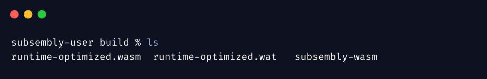

# subsembly compile

### Overview

Compiles current **`Subsembly`** project. More specifically it installs the dependencies and generates the required files for the Runtime to support the `metadata` interface used by PolkadotJS. Lastly, it compiles the **`Subsembly`** Runtime into the hex encoded `wasm` binary file \(WASM blob\).

### Workflow 

The workflow of the compile command is following:

1. Make sure the dependencies are installed by checking **`node_modules`** folder.
2.  Generate metadata of the project 
   1. Parse system and other modules inside **`assembly/pallets`** directory to extract storage entries, calls and constants. 
   2. Generate files: 
      1. **`metadata.ts`** 

         Contains a function that returns SCALE encoded metadata of the project

      2. **`dispatcher.ts`**

         Contains a function that is used to dispatch extrinsic calls of corresponding modules 
   3. Build **`wasm`** file: 

      Compile AS project into **`.wasm`** file, hex encode the binary and save it in build directory.

### Build folder

AssemblyScript places compiled **`wasm`** files inside the build folder in the root directory. The hex encoded **`wasm`** bytecode of **`Subsembly`** runtime is also placed in the same folder.

### Syntax

```text
subsembly compile
```

### Examples

```text
# creates new compiled wasm of the runtime in /build directory
subsembly compile
```

And the result of this command is reflected in build folder:



