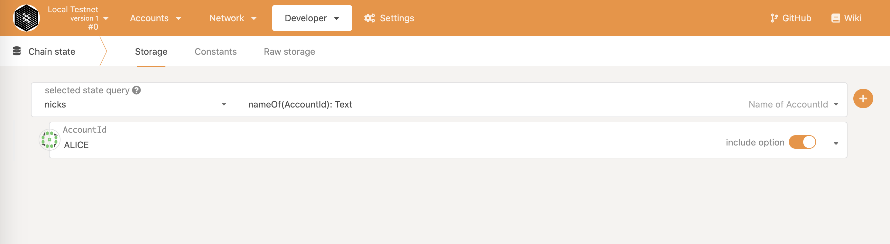
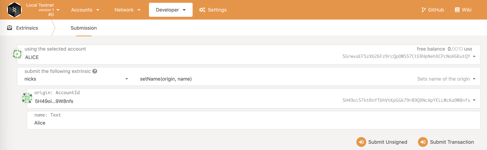

# PolkadotJs

### Query storage

Run the PolkadotJs in previous guides and open the **Chain State** section of the **Developer** tab. You should see something similar to this:

We can query the chain, but it will be empty.

### Extrinsics

In the same Developer tab switch to **Extrinsics** section. Pick **`Nicks`** module and select the **`set_name`** extrinsic:

Submit the extrinsic and see if the extrinsic is approved. You can also go back to the **Chain State** section and query the storage for the above account.

// TO-DO append picture with successful extrinsic

