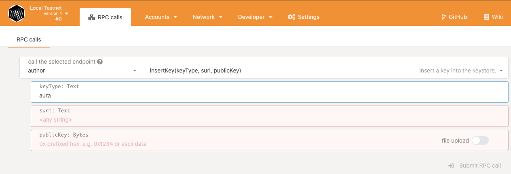
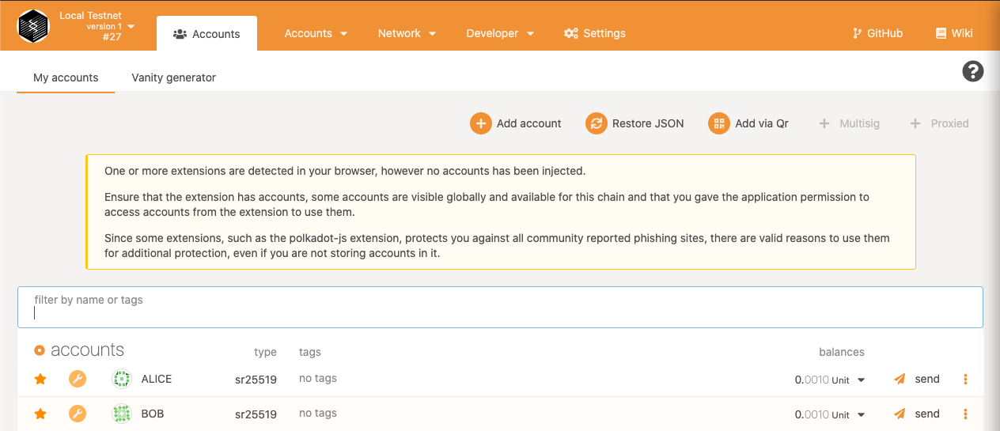
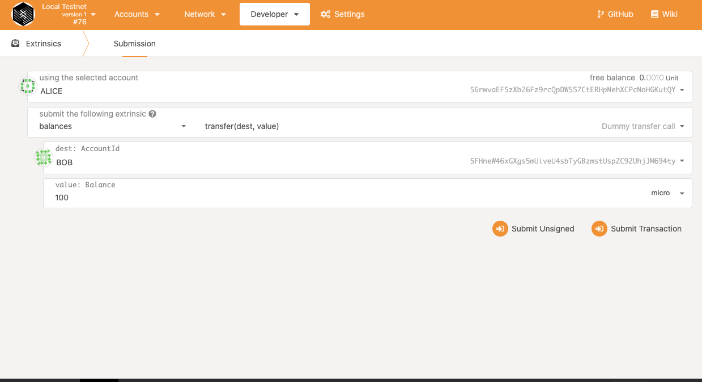
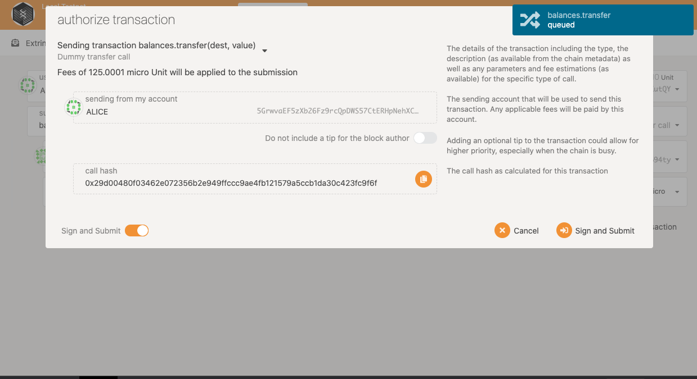
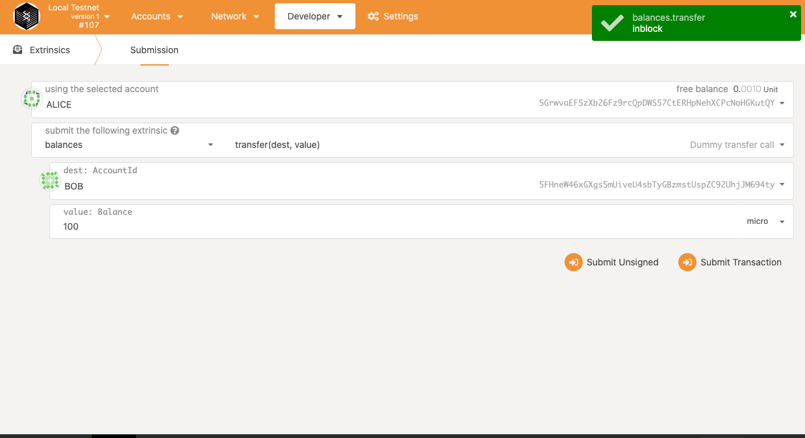

# PolkadotJS

## Interact

Once your node is running, go to PolkadotJS interface at [https://polkadot.js.org/apps](https://polkadot.js.org/apps). PolkadotJS interface provides an interface for interacting with your node. You can explore the produced blocks, query the chain storage, submit extrinsics, etc. In this section we will explore various ways to interact with your runtime.

## Insert Aura keys

One other option to insert your Aura keys is using PolkadotJS:

Fill out the necessary fields and submit the `rpc` call.

## Accounts

In the accounts tab, you can explore list of accounts in the storage:

## Transfers

Go to the **Extrinsics** section of the **Developer** tab and select **`transfer`** extrinsic call:

Fill up the fields and submit the transaction. The next window will look similar to this:

Click **Sign and Submit** to send the transfer and in couple of seconds, you will get a notification about the status of your transaction:

## Others

You can see the block issuance and the details of the produced blocks. Querying the state of the chain can be done in the `Developer` -&gt; `Chain state`

