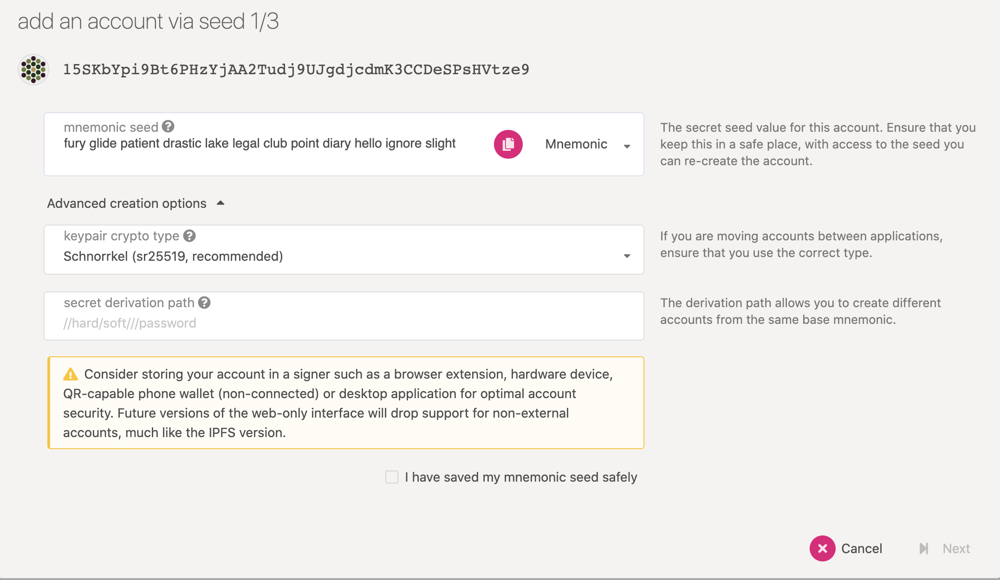

# Generate Authority Keys

### Overview

Ideally, each node who wants to participate as validator in the blockchain network should generate their own keys, but for demonstration purposes we've used default Alice and Bob keys. In this section, we will generate our own key that will be used to participate in the network.

### Option 1: Subkey

**`Subkey`** is a tool that generates keys specifically designed to be used with Substrate. The installation instructions can be found [here](https://substrate.dev/docs/en/knowledgebase/integrate/subkey).

After you've installed the tool, it's time to generate the validator keys. We need to generate **`sr25519`** keys that will be used by Aura for block production.

```text
subkey generate --scheme sr25519
```

You should see output similar to this:

```text
Secret phrase `lady demand candy vacuum warm nurse shaft garment horror list burst strike` is account:
  Secret seed:      0xfd3a2bd1b11943302b4a007857189629be5ae7ba55bf90a15f6eca939d6c763b
  Public key (hex): 0xec9fd69c119fb45b6f6efca397db3e864649e6903cf227d4609ed53a66d3bf1e
  Account ID:       0xec9fd69c119fb45b6f6efca397db3e864649e6903cf227d4609ed53a66d3bf1e
  SS58 Address:     5HQxe4hw4bZm5uK4kUeq3Wkvw7Uem7NesYjB53BjAUizNZN6
```

Make sure to save your mnemonic phrase somewhere secure, as it will be used later for inserting your Aura keys to the keystore.

### Option 2: PolkadotJs

You can also generate your own keys using PolkadotJs interface. In the Accounts tab, select **Add Account** button. This will generate **`sr25519`** keys by default. Again, make sure to save your mnemonic seed and public key.

For example:



