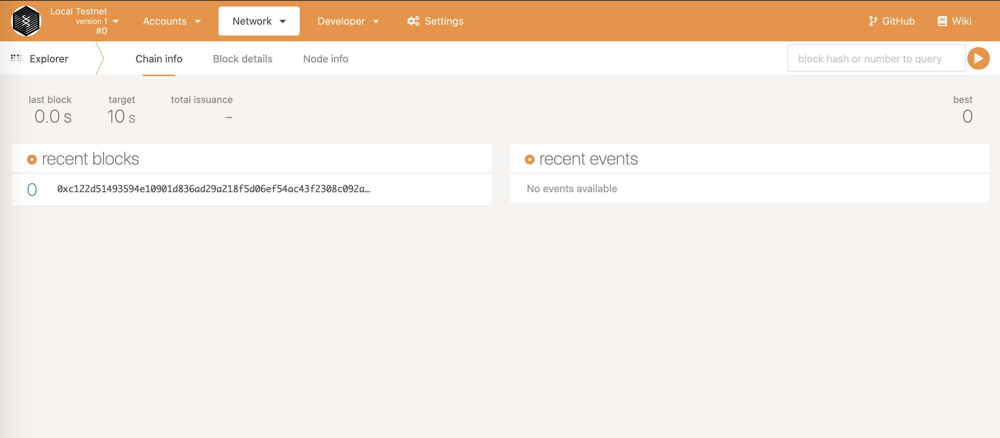
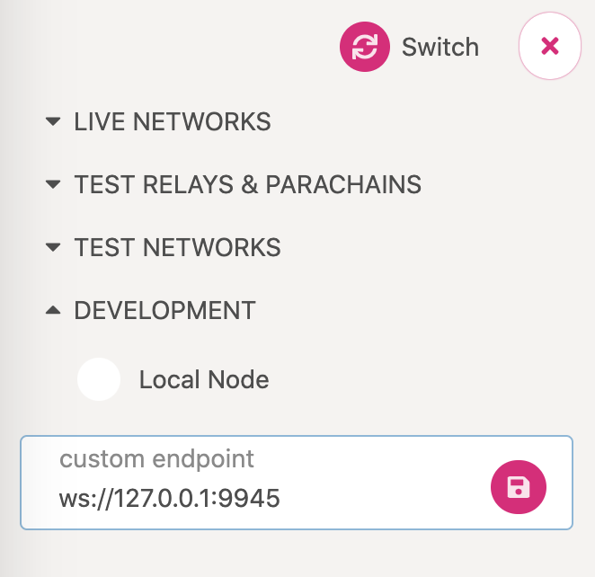

# Launch a Network

## Introduction

Before we generate our keys and edit the chain spec files, we need are going to launch a network of two nodes: **Alice** and **Bob**.

## Alice Starts the Node

The prerequisite for this step is a compiled runtime and generated chain spec file. Refer to [**Development**](../../development/development.md) section or to [previous](../create-your-first-subsembly-runtime/) guide on how to do it.

Alice runs the following commands inside the **Subsembly** project root folder:

```text
make run-node \
NAME=node01 \
PORT=30333 \
WS-PORT=9944 \
RPC-PORT=9933 \
spec=raw-chain-spec.json \
-- --validator
```

What do those flags represent?

```text
NAME= Specifies the name of your Node
PORT = Specifies the port that your node will listen for p2p traffic on
WS-PORT = Specifies the port that your node will listen for p2p traffic on
RPC-PORT = Specifies the port that your node will listen for incoming RPC traffic on
spec = Specifies path to the raw chain spec file
OTHER = Specifies additional flags/options to provide to the node. In this case, we want our node to be validator
```

More details about the flags and other options for the node, can be explored with the following command:

```text
make run-node help=1
```

After running the last command, you should see the following output:

```text
Mar 25 16:11:41.565  INFO Substrate Node    
Mar 25 16:11:41.565  INFO ✌️  version 2.0.0-unknown-x86_64-linux-gnu    
Mar 25 16:11:41.565  INFO ❤️  by Substrate DevHub <https://github.com/substrate-developer-hub>, 2017-2021    
Mar 25 16:11:41.565  INFO 📋 Chain specification: Local Testnet    
Mar 25 16:11:41.565  INFO 🏷  Node name: noisy-channel-3350    
Mar 25 16:11:41.565  INFO 👤 Role: AUTHORITY    
Mar 25 16:11:41.566  INFO 💾 Database: RocksDb at /tmp/node01/chains/local_testnet/db    
Mar 25 16:11:41.566  INFO ⛓  Native runtime: node-template-1 (node-template-1.tx1.au1)    
Mar 25 16:11:41.701  INFO 🔨 Initializing Genesis block/state (state: 0x54d1…dab9, header-hash: 0x1bef…c190)    
Mar 25 16:11:41.725  INFO ⏱  Loaded block-time = 5000 milliseconds from genesis on first-launch    
Mar 25 16:11:41.725  WARN Using default protocol ID "sup" because none is configured in the chain specs    
Mar 25 16:11:41.726  INFO 🏷  Local node identity is: 12D3KooWGtgEa8AuxLMnuKf71qE1bPb2nGKXbgmyjhC5G1w7Yrrf (legacy representation: 12D3KooWGtgEa8AuxLMnuKf71qE1bPb2nGKXbgmyjhC5G1w7Yrrf)    
Mar 25 16:11:41.730  INFO 📦 Highest known block at #0    
Mar 25 16:11:41.731  INFO 〽️ Prometheus server started at 127.0.0.1:9615    
Mar 25 16:11:41.733  INFO Listening for new connections on 127.0.0.1:9944.    
Mar 25 16:11:46.736  INFO 💤 Idle (0 peers), best: #0 (0x1bef…c190), finalized #0 (0x1bef…c190), ⬇ 0 ⬆ 0    
Mar 25 16:11:51.707  INFO 💤 Idle (0 peers), best: #0 (0x1bef…c190), finalized #0 (0x1bef…c190), ⬇ 0 ⬆ 0
```

We copy Alice's node identity to use it when we are connecting other nodes to Alice's:

```text
Mar 25 16:11:41.726  INFO 🏷  Local node identity is: 12D3KooWGtgEa8AuxLMnuKf71qE1bPb2nGKXbgmyjhC5G1w7Yrrf (legacy representation: 12D3KooWGtgEa8AuxLMnuKf71qE1bPb2nGKXbgmyjhC5G1w7Yrrf)
```

## Connect to PolkadotJs

Once your node is running, go to PolkadotJS interface at [https://polkadot.js.org/apps](https://polkadot.js.org/apps). PolkadotJS interface provides an interface for interacting with your node and it should automatically connect to your local node:



## Bob Joins

In a separate terminal, run the node for Bob:

```text
make run-node \
PORT=30334 \
WS-PORT=9945 \
RPC-PORT=9934 \
spec=raw-chain-spec.json \
NAME=node02 \
-- --validator \
--bootnodes /ip4/127.0.0.1/tcp/30333/p2p/12D3KooWEyoppNCUx8Yx66oV9fJnriXwCcXwDDUA2kj6vnc6iDEp
```

We can notice some differences compared to the command used to run Alice's node. We changed the ports and name of the node, since two nodes can not have the same name and one port can not be exposed from two different nodes.

Most importantly, we added a **`--bootnodes`** flag, to specify a single boot node of Alice. Here, the value of **`--bootnodes`** flag is comprised of following properties:

* Alice's IP Address, localhost or `127.0.0.1`
* Alice's Port, she specified `30333`
* Alice's Peer ID, we copied it in the Alice's section

After running the command you should see the output similar to this:

```text
Mar 31 14:06:51.017  INFO Substrate Node    
Mar 31 14:06:51.017  INFO ✌️  version 2.0.0-unknown-x86_64-linux-gnu    
Mar 31 14:06:51.017  INFO ❤️  by Substrate DevHub <https://github.com/substrate-developer-hub>, 2017-2021    
Mar 31 14:06:51.017  INFO 📋 Chain specification: Local Testnet    
Mar 31 14:06:51.017  INFO 🏷  Node name: node02    
Mar 31 14:06:51.017  INFO 👤 Role: FULL    
Mar 31 14:06:51.017  INFO 💾 Database: RocksDb at /tmp/node02/chains/local_testnet/db    
Mar 31 14:06:51.017  INFO ⛓  Native runtime: node-template-1 (node-template-1.tx1.au1)    
Mar 31 14:06:51.156  INFO 🔨 Initializing Genesis block/state (state: 0x6ae8…bdb7, header-hash: 0xc122…3dac)    
Mar 31 14:06:51.182  INFO ⏱  Loaded block-time = 5000 milliseconds from genesis on first-launch    
Mar 31 14:06:51.182  WARN Using default protocol ID "sup" because none is configured in the chain specs    
Mar 31 14:06:51.183  INFO 🏷  Local node identity is: 12D3KooWLLpxfFcFDAidDgQMy6CCUY1Tc67zj6xLkYzBRRjmnFDd (legacy representation: 12D3KooWLLpxfFcFDAidDgQMy6CCUY1Tc67zj6xLkYzBRRjmnFDd)    
Mar 31 14:06:51.186  INFO 📦 Highest known block at #0    
Mar 31 14:06:51.187  INFO 〽️ Prometheus server started at 127.0.0.1:9615    
Mar 31 14:06:51.188  INFO Listening for new connections on 0.0.0.0:9945.    
Mar 31 14:06:52.212  INFO 🔍 Discovered new external address for our node: /ip4/172.17.0.3/tcp/30334/p2p/12D3KooWLLpxfFcFDAidDgQMy6CCUY1Tc67zj6xLkYzBRRjmnFDd    
Mar 31 14:06:56.190  INFO 💤 Idle (1 peers), best: #0 (0xc122…3dac), finalized #0 (0xc122…3dac), ⬇ 1.0kiB/s ⬆ 1.0kiB/s    
Mar 31 14:07:01.190  INFO 💤 Idle (1 peers), best: #0 (0xc122…3dac), finalized #0 (0xc122…3dac), ⬇ 0 ⬆ 0    
Mar 31 14:07:06.194  INFO 💤 Idle (1 peers), best: #0 (0xc122…3dac), finalized #0 (0xc122…3dac), ⬇ 0 ⬆ 0
```

As you see from the output \(**`1 peers`**\), Bob successfully connected to the Alice's node:

```text
Mar 31 14:06:56.190  INFO 💤 Idle (1 peers), best: #0 (0xc122…3dac), finalized #0 (0xc122…3dac), ⬇ 1.0kiB/s ⬆ 1.0kiB/s
```

You can also connect this node to PolkadotJs interface. To do that, you will need to change the **`ws`** port in the left tab in the main page \(`9945` in this case\)



